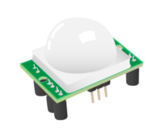

## Passive Infra-red (PIR) motion sensors 

PIR (Passive Infrared) motion sensors are electronic devices that detect motion by measuring infrared light radiating from objects in their field of view. PIR motion sensors can be used to sense movement and trigger various actions in your projects.

PIR sensors are designed to detect changes in the amount of infrared radiation. When an object, such as a person or animal, enters the sensor's range, the sensor detects the change and sends a signal to the connected GPIO pin on the Raspberry Pi. This signal can be used to perform tasks like turning on lights, activating alarms, or starting a recording.

The key advantage of PIR motion sensors is their simplicity and effectiveness in detecting movement without requiring a direct line of sight. They are widely used in security systems, automatic lighting, and various interactive applications.