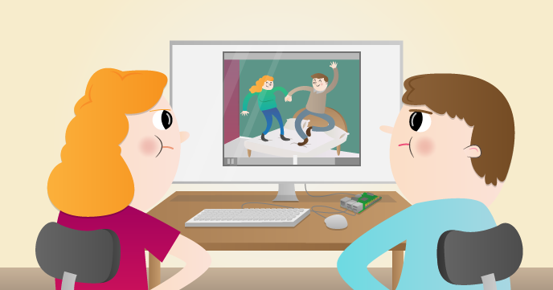

## What next?

You could have your LDR turn on an [LED](https://projects.raspberrypi.org/en/projects/rpi-LED){:target="_blank"}  when it sense motion, or use it to sound a [Buzzer](https://projects.raspberrypi.org/en/projects/rpi-buzzer){:target="_blank"}!

If you are looking for a longer project that uses PIRs, you could try the [Parent Detector](https://projects.raspberrypi.org/en/projects/parent-detector){:target="_blank"} project. In this project, you will use a Raspberry Pi camera and a PIR to find out who’s been in your room! Make a parent detector using a motion sensor to trigger video recording via the Raspberry Pi Camera Module.

